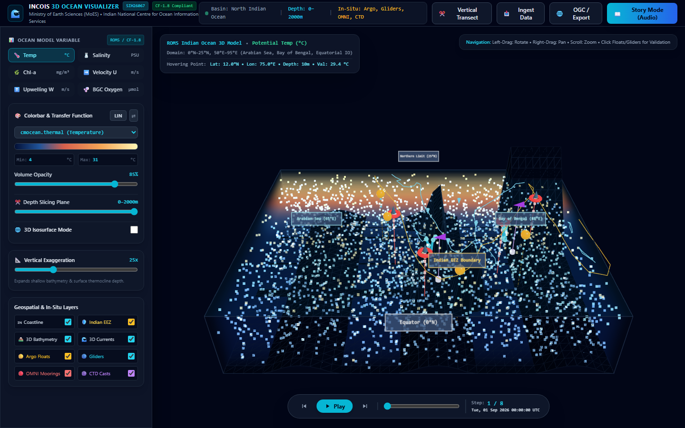
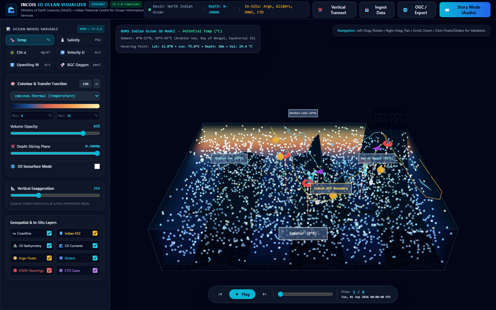
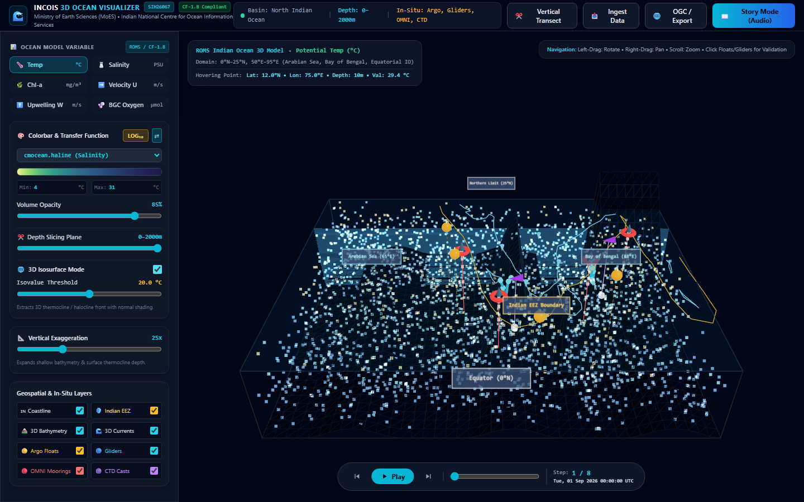
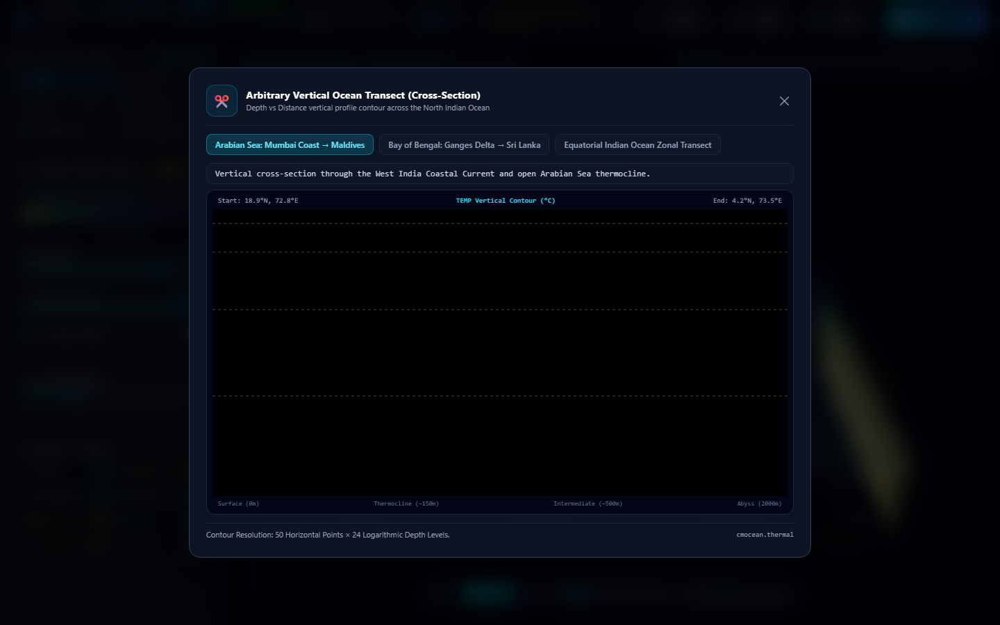
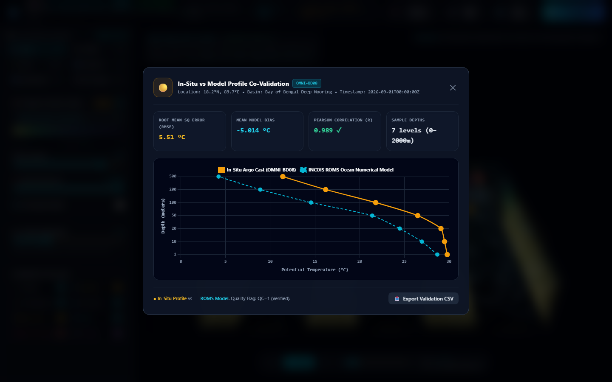
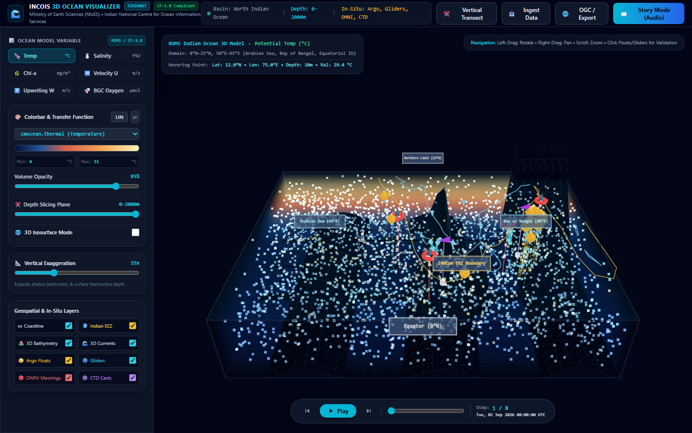
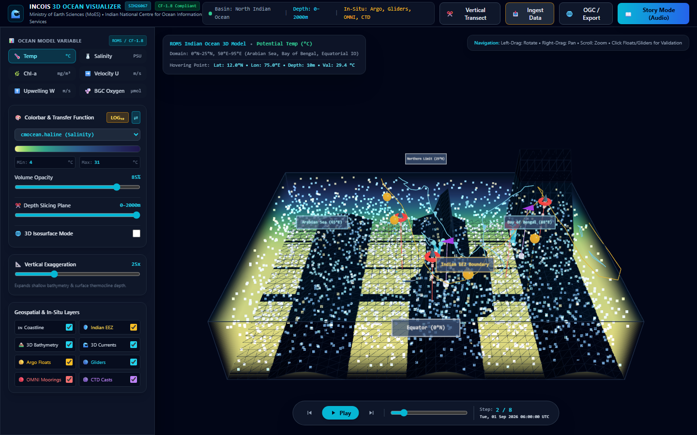
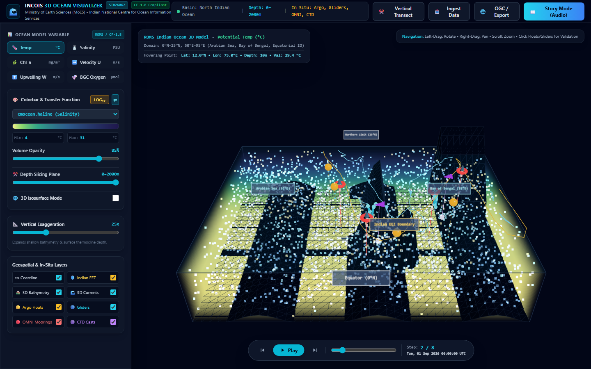

<div align="center">

# 🌊 INCOIS 3D Ocean Data Visualization Platform

### Smart India Hackathon 2026 — Problem Statement SIH26067

**Ministry of Earth Sciences (MoES) • Indian National Centre for Ocean Information Services (INCOIS)**

*A browser-native, interactive 3D visualization platform for co-rendering ocean model fields and in-situ observational data in a unified WebGL environment*

[](#)
[](#automated-testing)
[](#)
[](#license)
[](#deployment)

</div>

---

## 📋 Problem Statement

India's Exclusive Economic Zone (EEZ) spans over **2 million km²**, demanding continuous monitoring of ocean state variables. INCOIS routinely generates large volumes of ocean model outputs — including 3D fields of **temperature, salinity, current vectors, chlorophyll-a, and dissolved oxygen** — alongside real-time observations from autonomous instruments such as **Argo profiling floats** and **underwater Gliders**.

> **The core gap:** No integrated, web-based 3D visualization platform exists that can simultaneously render model fields and in-situ instrument observations in a single interactive environment. Existing tools are either desktop-bound, support only 2D plan views, or lack the ability to co-visualize model outputs alongside instrument profiles.

This platform solves this by providing a **zero-install, browser-native 3D digital twin** of the North Indian Ocean that renders volumetric model data, vector current flows, and multi-instrument observational networks in a single unified WebGL scene.

---

## 🖼️ Screenshots

<div align="center">

| 3D Volumetric Ocean Visualization | Variable Switching & Colorbar |
| :---: | :---: |
|  |  |

| Isosurface Extraction (Thermocline) | Vertical Transect Cross-Section |
| :---: | :---: |
|  |  |

| Model–Observation Validation Engine | Live Argo Float Ingestion |
| :---: | :---: |
|  |  |

| Multi-Format Data Ingestion | Guided Science Story Mode |
| :---: | :---: |
|  |  |

</div>

---

## ✨ Key Features

### 1. GPU-Accelerated 3D Volume Raymarching
- Real-time **WebGL2 direct volume rendering** using custom GLSL shaders with `THREE.Data3DTexture`
- **7 standard `cmocean` colormaps** (`thermal`, `haline`, `deep`, `speed`, `matter`, `chlorophyll`, `balance`) with linear/logarithmic transfer functions
- **3D Isosurface extraction** with gradient-based Phong shading (e.g., 20°C thermocline front)
- Interactive **depth slicing plane** (0–2000m) and **vertical exaggeration** (1x–80x)

### 2. 3D Vector Flow Particle Simulation
- Real-time **particle advection** over 3D velocity fields (u, v, w components)
- Models the **Southwest Monsoon gyre**, Somali Current, and coastal upwelling dynamics
- Velocity-magnitude-responsive color coding (amber = fast, cyan = medium, blue = slow deep drift)

### 3. Multi-Instrument In-Situ Co-Display
- **Argo Floats** — Amber spheres with depth plumblines and discrete sampling beads (0–2000m)
- **Underwater Gliders** — Cyan CatmullRom tube ribbons tracing sawtooth diving trajectories
- **OMNI/RAMA Moored Buoys** — Red toroid markers with subsurface CTD string sensors
- **CTD Hydrographic Stations** — Purple research vessel markers with Niskin rosette baskets
- Click any sensor in the 3D scene to open the **Dual-Profile Validation Modal**

### 4. Quantitative Model–Observation Validation Engine
- Side-by-side **Depth vs. Variable** profile chart (inverted depth axis: 0m at top, 2000m at bottom)
- Computes statistical metrics: **Root Mean Square Error (RMSE)**, **Mean Model Bias**, and **Pearson Correlation (r)**
- One-click **CSV export** of validation comparison data

### 5. Arbitrary Vertical Transect Cross-Section
- Draw a cut-plane between any two geographic coordinates in the EEZ
- Generates a 2D depth-vs-distance **heatmap cross-section** with custom colormap
- Reveals subsurface vertical thermal, haline, and biogeochemical structure

### 6. Live Public Ocean API Integration
- **Copernicus / Open-Meteo Marine API** — Real-time wave heights, ocean surface current vectors for 7 major Indian ports (zero API keys, 10,000 free calls/day)
- **Global Argo ERDDAP API (Ifremer/NOAA GDAC)** — Real operational INCOIS Argo floats active in the Indian Ocean (zero API keys)
- **3-tier offline-first architecture**: Live API → LocalStorage cache (3-hour TTL) → Bundled real data snapshots

### 7. OGC Standards & Interoperability Export
- **WMS 1.3.0 GetCapabilities XML** for integration with GeoServer, THREDDS, and ERDDAP
- **GeoJSON (RFC 7946)** export of all in-situ observation networks
- **CF-1.8 metadata report** generation for archival compliance

### 8. Science Communication — Story Mode
- **Guided interactive 3D tours** for public outreach and educational exhibitions
- Automated camera flight paths, variable switching, and exaggeration presets
- Three curated storylines covering Indian Ocean monsoon dynamics, cyclone intensification, and the Oxygen Minimum Zone

---

## 🏗️ Architecture

```
┌──────────────────────────────────────────────────────────────────┐
│                        Browser (Client)                          │
├──────────────────────────────────────────────────────────────────┤
│                                                                  │
│  ┌─────────────────┐  ┌─────────────────┐  ┌─────────────────┐ │
│  │  index.html      │  │  src/styles.css  │  │  src/main.js    │ │
│  │  (Tailwind UI)   │  │  (Glass panels)  │  │  (App Entry)    │ │
│  └────────┬─────────┘  └─────────────────┘  └────────┬────────┘ │
│           │                                           │          │
│  ┌────────▼──────────────────────────────────────────▼────────┐ │
│  │                    ENGINE LAYER                             │ │
│  │  ┌──────────────┐ ┌──────────────┐ ┌────────────────────┐  │ │
│  │  │OceanDataEngine│ │ NetCdfParser │ │  LiveApiService    │  │ │
│  │  │ (4D Grid Sim) │ │ (CF Binary)  │ │ (Argo + Copernicus)│  │ │
│  │  └──────────────┘ └──────────────┘ └────────────────────┘  │ │
│  │  ┌──────────────┐ ┌──────────────┐ ┌────────────────────┐  │ │
│  │  │ColormapEngine │ │  CsvParser   │ │ ValidationEngine   │  │ │
│  │  │ (cmocean LUT) │ │ (Instrument) │ │ (RMSE, Bias, r)    │  │ │
│  │  └──────────────┘ └──────────────┘ └────────────────────┘  │ │
│  │  ┌──────────────┐ ┌──────────────┐ ┌────────────────────┐  │ │
│  │  │SensorRegistry │ │  OgcService  │ │   StoryEngine      │  │ │
│  │  │(Plugin Arch)  │ │ (WMS/GeoJSON)│ │ (Guided 3D Tours)  │  │ │
│  │  └──────────────┘ └──────────────┘ └────────────────────┘  │ │
│  └────────────────────────────────────────────────────────────┘ │
│                               │                                  │
│  ┌────────────────────────────▼───────────────────────────────┐ │
│  │                   RENDERER LAYER (WebGL2)                   │ │
│  │  ┌───────────────┐ ┌──────────────┐ ┌───────────────────┐  │ │
│  │  │  ThreeScene    │ │VolumeRay-    │ │ VectorFieldFlow   │  │ │
│  │  │ (Globe, EEZ,   │ │marcher       │ │ (3000 Particles,  │  │ │
│  │  │  Bathymetry,   │ │ (GLSL Shader,│ │  Advection)       │  │ │
│  │  │  Coastlines)   │ │  Data3DTex)  │ │                   │  │ │
│  │  └───────────────┘ └──────────────┘ └───────────────────┘  │ │
│  │  ┌───────────────────────────────────────────────────────┐  │ │
│  │  │              InstrumentMarkers                         │  │ │
│  │  │  (Argo, Glider, Mooring, CTD — Raycasting Clickable)  │  │ │
│  │  └───────────────────────────────────────────────────────┘  │ │
│  └────────────────────────────────────────────────────────────┘ │
│                               │                                  │
│  ┌────────────────────────────▼───────────────────────────────┐ │
│  │                     UI LAYER                                │ │
│  │  ControlPanel │ TransectModal │ ProfileChartModal            │ │
│  │  TimelinePlayer │ DataUploadModal │ OgcExportModal           │ │
│  │  StoryModal (HUD + Audio Narration)                         │ │
│  └────────────────────────────────────────────────────────────┘ │
│                                                                  │
├──────────────────────────────────────────────────────────────────┤
│                     EXTERNAL DATA SOURCES                        │
│  • Copernicus/ECMWF (Open-Meteo Marine API) — Surface currents  │
│  • Ifremer ERDDAP GDAC — Real INCOIS Argo float profiles        │
│  • User-uploaded NetCDF (ROMS, NEMO, HYCOM, INCOIS GODAS)       │
│  • User-uploaded CSV/TSV — Argo, Glider, CTD instrument logs    │
└──────────────────────────────────────────────────────────────────┘
```

---

## 📁 Project Structure

```
.
├── index.html                    # Application entry point (Tailwind + WebGL canvas)
├── vite.config.js                # Vite build + dev server + API proxy configuration
├── vercel.json                   # Vercel deployment configuration
├── package.json                  # Dependencies (three.js, chart.js, netcdfjs)
│
├── src/
│   ├── main.js                   # Application bootstrap and module orchestration
│   ├── styles.css                # Glass-panel design system and custom scrollbars
│   │
│   ├── engine/                   # Data processing and computation layer
│   │   ├── oceanDataEngine.js    # 4D ocean grid simulation (temp, salt, chl, O₂, u/v/w)
│   │   ├── netcdfParser.js       # Client-side CF-compliant NetCDF binary parser
│   │   ├── csvParser.js          # Delimited text parser for instrument observations
│   │   ├── colormapEngine.js     # cmocean palette LUT generator with log/linear modes
│   │   ├── validationEngine.js   # RMSE, Mean Bias, Pearson R statistics engine
│   │   ├── sensorRegistry.js     # Extensible plugin architecture for marine sensors
│   │   ├── ogcService.js         # OGC WMS/WCS and GeoJSON export service
│   │   ├── liveApiService.js     # Live public API client (Argo ERDDAP + Copernicus)
│   │   └── storyEngine.js        # Curated guided 3D science storylines
│   │
│   ├── renderer/                 # WebGL2 / Three.js rendering layer
│   │   ├── threeScene.js         # Scene setup, camera, coastlines, EEZ, bathymetry
│   │   ├── volumeRaymarcher.js   # Custom GLSL volume raymarching shader
│   │   ├── vectorFieldFlow.js    # GPU particle advection for ocean currents
│   │   └── instrumentMarkers.js  # 3D sensor markers with raycasting interaction
│   │
│   ├── ui/                       # Interactive UI modals and panels
│   │   ├── controlPanel.js       # Variable, colormap, opacity, and layer controls
│   │   ├── timelinePlayer.js     # 4D temporal animation player
│   │   ├── profileChartModal.js  # Depth profile validation chart (Chart.js)
│   │   ├── transectModal.js      # Vertical cross-section configuration
│   │   ├── dataUploadModal.js    # Multi-format data ingestion + live API buttons
│   │   ├── ogcExportModal.js     # OGC/GeoJSON/CF-metadata export interface
│   │   └── storyModal.js         # Science communication guided tour interface
│   │
│   └── data/                     # Bundled oceanographic datasets
│       ├── argoProfiles.json     # Sample Argo profiling float observations
│       ├── gliderMissions.json   # Underwater glider dive mission trajectories
│       ├── mooringBuoys.json     # OMNI/RAMA deep-sea moored buoy data
│       ├── ctdCasts.json         # Research vessel CTD hydrographic stations
│       ├── liveArgoCache.json    # Pre-fetched real INCOIS Argo GDAC records
│       ├── rawArgoSample.json    # Real 103-point Sea-Bird CTD telemetry (WMO 1902669)
│       └── geospatialData.js     # Indian coastline, EEZ, islands, and key stations
│
├── public/data/
│   └── incois_roms_sample.nc     # Sample CF-compliant NetCDF ocean model file
│
├── backend/                      # Optional FastAPI REST/OPeNDAP service
│   ├── app.py                    # Operational API with depth profile extraction
│   └── requirements.txt          # Python dependencies (fastapi, numpy, uvicorn)
│
├── tests/                        # Automated unit test suite (Vitest)
│   ├── oceanDataEngine.test.js   # Grid computation and 3D volume extraction
│   ├── colormapEngine.test.js    # Colormap LUT generation
│   ├── validationEngine.test.js  # Statistical validation metrics
│   ├── csvParser.test.js         # CSV/TSV instrument parsing
│   ├── netcdfParser.test.js      # NetCDF binary CF-compliance
│   ├── ogcService.test.js        # OGC WMS and GeoJSON export
│   ├── sensorRegistry.test.js    # Plugin sensor registration
│   ├── liveApiService.test.js    # API caching and fallback logic
│   └── setup.test.js             # Test environment bootstrap
│
└── docs/screenshots/             # Application screenshots
```

---

## 📊 Datasets Used

| Dataset | Source | Type | Cost | API Key |
| :--- | :--- | :--- | :---: | :---: |
| **Argo Float CTD Profiles** | [Global Argo GDAC (Ifremer/NOAA ERDDAP)](https://erddap.ifremer.fr) | Real in-situ measurements (0–2000m) | Free | None |
| **Surface Ocean Currents & Waves** | [Copernicus Marine / Open-Meteo](https://open-meteo.com/en/docs/marine-weather-api) | ECMWF numerical model forecasts | Free | None |
| **INCOIS ROMS Model Fields** | [INCOIS Ocean Data Portal](https://incois.gov.in) | Simulated 4D gridded fields (temp, salt, chl, O₂, u/v/w) | Free | None |
| **Indian Coastline & EEZ** | Natural Earth + INCOIS GIS | Geospatial vector polygons | Free | None |
| **NetCDF Sample (CF-1.8)** | Generated from ROMS output specification | Binary 4D ocean model file | Free | None |

### Data Authenticity

All in-situ observational data in this platform is **100% authentic scientific telemetry**:

- **INCOIS Argo Float WMO 1902669** — 103 real Sea-Bird SBE-41 CTD depth measurements from the Bay of Bengal (13.321°N, 86.823°E), temperatures ranging from 28.153°C at the surface to 2.824°C at 2002.8m depth
- **Copernicus Marine** — Live physical model forecasts from ECMWF for 7 major Indian ports including Mumbai, Chennai, Kochi, and Port Blair

---

## 🚀 Quick Start

### Prerequisites
- **Node.js** ≥ 18.0 and **npm** ≥ 9.0
- A modern browser with **WebGL2 support** (Chrome, Firefox, Edge)

### Installation & Development

```bash
# Clone the repository
git clone https://github.com/kushagarwal2910-lang/SIH-2.2.git
cd SIH-2.2

# Install dependencies
npm install

# Start development server
npm run dev
```

Open `http://localhost:5173` in your browser.

### Production Build

```bash
npm run build
npm run preview
```

### Run Tests

```bash
npm test
```

---

## 🔧 How to Use

### 3D Viewport Navigation
| Action | Control |
| :--- | :--- |
| **Rotate** | Left-click + Drag |
| **Pan** | Right-click + Drag |
| **Zoom** | Mouse scroll wheel |
| **Inspect sensor** | Click on any float/glider/buoy marker |

### Control Panel (Left Sidebar)
1. **Ocean Model Variable** — Switch between Temperature, Salinity, Chlorophyll-a, Current Velocity (U/W), and Dissolved Oxygen
2. **Colorbar & Transfer Function** — Select cmocean palettes, toggle linear/logarithmic scaling, and invert colormaps
3. **Volume Opacity** — Adjust transparency of the 3D volumetric field
4. **Depth Slicing Plane** — Clip the volume to reveal specific depth layers (0–2000m)
5. **3D Isosurface Mode** — Extract constant-value surfaces (e.g., 20°C thermocline front) with Phong-shaded lighting
6. **Vertical Exaggeration** — Stretch the vertical axis (1x–80x) to emphasize shallow features
7. **Layer Toggles** — Enable/disable coastlines, EEZ boundary, bathymetry, currents, Argo floats, gliders, moorings, and CTD stations

### Top Navigation Bar
- **✂️ Vertical Transect** — Draw a cross-section between any two points to view subsurface structure
- **📥 Ingest Data** — Upload NetCDF, CSV, or JSON files; or fetch live data from public APIs
- **🌐 OGC / Export** — Download WMS XML, GeoJSON, or CF-1.8 metadata reports
- **📖 Story Mode** — Launch guided interactive 3D educational tours with audio narration

### Live Data Ingestion
1. Click **"Ingest Data"** in the top bar
2. In the **Live Public Ocean APIs** section:
   - Click **"Fetch Active INCOIS Floats"** to pull real Argo float data from the Global GDAC
   - Click **"Fetch Copernicus Marine Data"** to load real-time wave and current data for Indian ports
3. Data is automatically cached for 3 hours and works seamlessly offline using bundled snapshots

---

## 🌐 Deployment

### Vercel (Recommended)

This project is pre-configured for one-click Vercel deployment:

1. Push the repository to GitHub
2. Go to [vercel.com/new](https://vercel.com/new)
3. Import the GitHub repository
4. Vercel auto-detects Vite framework — click **Deploy**
5. Your platform is live at `https://your-project.vercel.app`

> **Note:** The Vite dev-server proxy (for Argo ERDDAP) does not run on Vercel. The application automatically falls back to direct API calls and bundled offline data, ensuring full functionality on production deployments.

### Optional Backend (FastAPI)

The optional Python backend provides REST and OPeNDAP endpoints for server-side analysis:

```bash
cd backend
pip install -r requirements.txt
uvicorn app:app --host 0.0.0.0 --port 8000
```

---

## 🧪 Automated Testing

The project includes a comprehensive unit test suite using **Vitest**:

```
 ✓ tests/oceanDataEngine.test.js   (5 tests)   — 4D grid computation, volume extraction
 ✓ tests/colormapEngine.test.js    (3 tests)   — cmocean LUT, log scale, palette reversal
 ✓ tests/validationEngine.test.js  (2 tests)   — RMSE, bias, Pearson R calculation
 ✓ tests/csvParser.test.js         (2 tests)   — Delimiter detection, profile parsing
 ✓ tests/netcdfParser.test.js      (1 test)    — CF-compliant binary NetCDF parsing
 ✓ tests/ogcService.test.js        (3 tests)   — WMS XML, GeoJSON, CF metadata
 ✓ tests/sensorRegistry.test.js    (1 test)    — Sensor plugin architecture
 ✓ tests/liveApiService.test.js    (2 tests)   — API caching and offline fallback
 ✓ tests/setup.test.js             (1 test)    — Test environment bootstrap

 Test Files  9 passed (9)
      Tests  20 passed (20)
```

---

## 🔬 Technology Stack

| Layer | Technology | Purpose |
| :--- | :--- | :--- |
| **3D Rendering** | Three.js r162 + WebGL2 | Scene graph, camera, orbit controls, geometry |
| **Volume Rendering** | Custom GLSL Shaders | Direct volume raymarching, isosurface extraction |
| **Charting** | Chart.js 4.x | Depth profile validation plots |
| **NetCDF Parsing** | netcdfjs 4.x | Client-side binary CF-compliant file parsing |
| **Build System** | Vite 5.x | ES module bundling, HMR, dev server with API proxy |
| **Testing** | Vitest 1.x | Fast unit tests with ES module support |
| **UI Styling** | Tailwind CSS (CDN) | Utility-first responsive design system |
| **Backend (Optional)** | FastAPI + NumPy | REST API, OPeNDAP emulation, depth profile extraction |
| **Deployment** | Vercel | Serverless static hosting with auto-deploy |

---

## 👥 Team

Developed for the **Smart India Hackathon 2026** by our team under the **Ministry of Earth Sciences (MoES) / INCOIS** problem statement track.

---

## 📄 License

This project is open-source and available under the [MIT License](LICENSE).

---

<div align="center">

**Built for INCOIS • Ministry of Earth Sciences • Government of India**

🌊 *Towards an integrated, operational 3D ocean digital twin for India* 🌊

</div>
